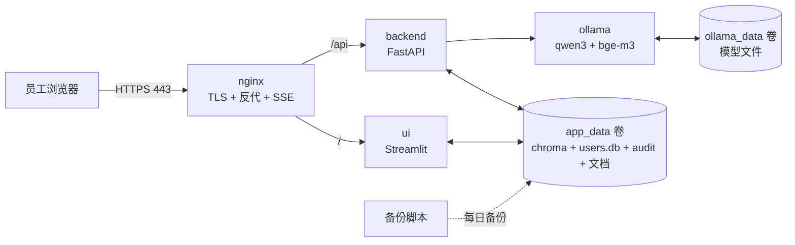

# 企业内部知识库 RAG —— 项目总结

> 从零手写、可内网部署的企业知识库问答系统。纯 Python RAG（不依赖 LangChain），
> 全流程覆盖：文档接入 → 向量检索 → 生成问答 → 权限/审计/登录 → 评估 → 部署 → 运维。

## 里程碑

| 提交 | 内容 |
| --- | --- |
| b23c343 | 从零搭建：RAG 全流程 + Docker + 评估 |
| 04b6ccc | 生产加固：登录认证 + 限流 + 设计版前端 |
| e2160a0 | 安全加固：安全日志 + 管理员权限 + HTTPS 反代 + 备份 |
| 763f3a7 | 前端容器化 + 运维手册 + 域名/IP 切换流程 |
| 8ac7d74 | 文档归属与权限守卫 + 分块保护 + 标题上下文 + 动态推荐 |

## 技术栈

| 组件 | 选择 |
| --- | --- |
| LLM | Qwen3 8B（Ollama 本地） |
| Embedding | bge-m3（Ollama 本地） |
| 向量库 | Chroma（持久化） |
| 后端 | FastAPI（REST + SSE） |
| 前端 | Streamlit（登录门禁 + 流式聊天） |
| 认证 | SQLite + pbkdf2 + 服务端 token |
| 文档管理 | docmeta 登记表（归属 + 权限标签） |
| 部署 | Docker Compose（nginx + ui + backend + ollama） |

## 架构



## 功能模块

- 文档接入：md/txt/pdf/docx，PDF 页码，清洗 + 分块（150 字，经评估确定）
- 分块保护：表格/代码块整体保留；标题上下文（sections 多小节记录）
- 检索：向量召回 top20 + 语义/BM25 混合重排 + 权限过滤
- 问答：防幻觉 Prompt、引用标注、多轮历史、SSE 流式、推荐问题动态生成
- 认证：登录/登出/改密、pbkdf2 渐进重哈希、服务端 token（30 分钟）
- 权限：文档 access 标签 + 数据库层过滤；admin 角色 + 资源归属守卫
- 文档管理：上传（带权限标签）、删除（上传者/管理员）、归属登记
- 审计：问答审计（JSONL）+ 安全事件日志（SQLite，含登录/改密/上传/删除）
- 限流：登录/改密按 IP+用户名，5 次/5 分钟锁 15 分钟
- 评估：Hit@3（15/15）+ LLM 裁判（忠实度/相关性）
- 运维：备份脚本 + 恢复演练 + 轮转保留 7 份 + 证书过期检查

## 安全体系（分层）

1. 传输：HTTPS（nginx TLS 终结，内部 CA；XFF 防伪造）
2. 身份：登录 token（30 分钟过期、可即时吊销）
3. 权限：默认拒绝 + access 标签过滤 + admin 校验 + 资源归属守卫
4. 行为：问答审计 + 安全事件日志
5. 对抗：限流 + 慢哈希 + 路径穿越防护

## 文档体系

- README.md：项目总览与启动
- SUMMARY.md：本总结
- OPS.md：运维手册（巡检/备份/故障/证书）
- docs/permissions.md：权限体系说明与操作
- docs/domain-switch.md：域名/IP 切换流程

## 部署

```bash
docker compose up -d --build
# 首次：容器内拉模型
docker exec rag-ollama ollama pull bge-m3
docker exec rag-ollama ollama pull qwen3:8b
```

## 评估结论

- Hit@3 = 15/15（15 条正文关键词测试集）
- chunk_size=150、权重 0.7/0.3、top_n=3（对比实验确定）
- 语料扩大后需重跑实验

## 剩余事项

- SSO/OIDC（视公司是否有 IdP）
- Cookie 会话（可缓）
- 真实文档接入（替换示例，重跑评估）
- 定时任务：每日备份 + 每周证书检查（脚本已就位，待配 schtasks/cron）
- 上线清单：改默认密码、日志保留策略、密钥管理
